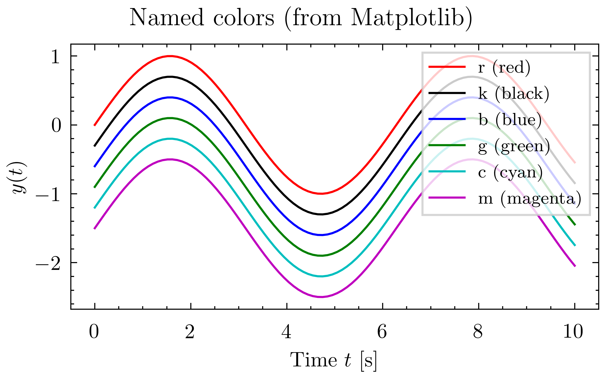
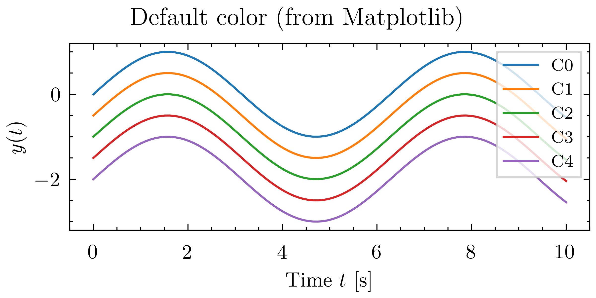
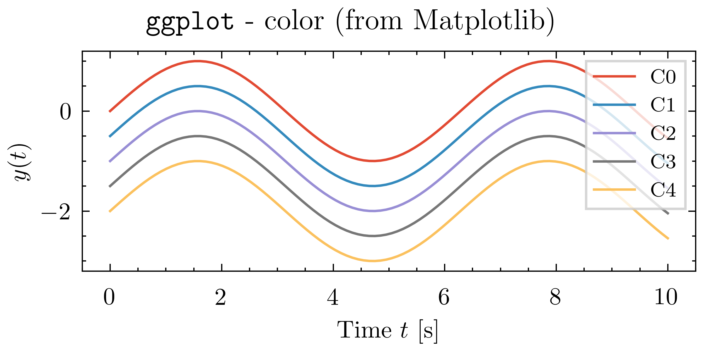
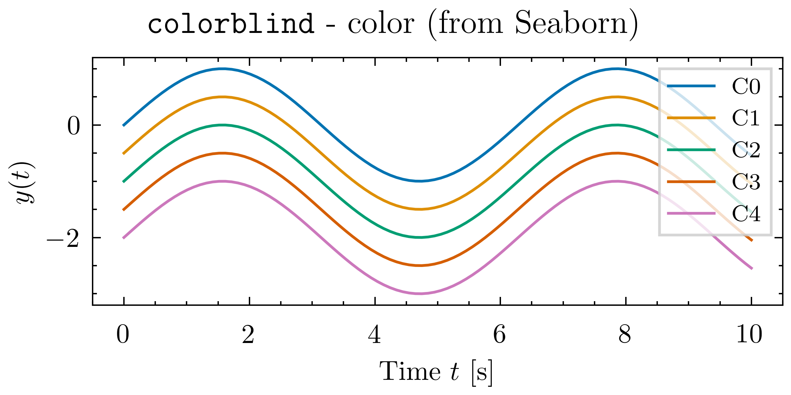
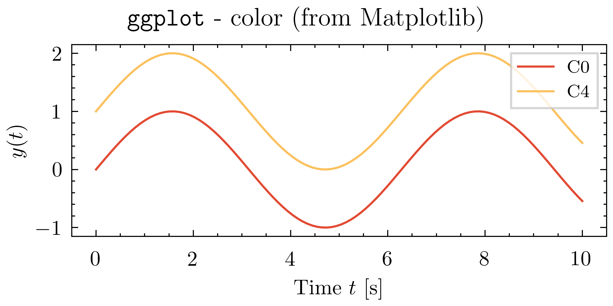

There are several convenient ways to specify colors in Matplotlib.

## Named colors

List of named colors is documented in the [Matplotlib documentation - Named Colors](https://matplotlib.org/stable/gallery/color/named_colors.html).
A simple example using named colors is shown below.

```python
--8<-- "docs/color/color-named.py"
```



## Color palettes
If you do not specify a color, Matplotlib will cycle through a set of colors. In addition to the default color cycle, we provide a few additional color palettes: `ggplot`[^ggplot] and `colorblind`[^colorblind] gathered from the Matplotlib and seaborn.

To use a different color palette in combination with the Physics Plot style sheet, just combine the style sheets as a list. For example, to use the `physics_plot.colors.ggplot` color palette globally:
```python
import matplotlib.pyplot as plt

plt.style.use(["physics_plot.pp_base", "physics_plot.colors.ggplot"])

# ... your plotting code here ...
```
or locally with a context manager:
```python
import matplotlib.pyplot as plt

with plt.style.context(["physics_plot.pp_base", "physics_plot.colors.ggplot"]):
    # ... your plotting code here ...
```

The available color palettes shipped with Physics Plot are: `physics_plot.colors.ggplot` and `physics_plot.colors.colorblind`, but you can also combine with any other Matplotlib style sheets.

---

Following is an example that demonstrates the different color cycles:
```python linenums="1" hl_lines="7 18 29"
--8<-- "docs/color/color.py"
```






!!! tip
    It is also possible to specify which color among the current color cycle to choose by using the `C0`, `C1`, ... notation.
    For instance,
    ```python linenums="1" hl_lines="10 11"
    ---8<-- "docs/color/color-CN.py"
    ```
    


[^ggplot]: The `ggplot` color palette is taken from Matplotlib at [https://github.com/matplotlib/matplotlib/blob/v3.10.7/lib/matplotlib/mpl-data/stylelib/ggplot.mplstyle](https://github.com/matplotlib/matplotlib/blob/v3.10.7/lib/matplotlib/mpl-data/stylelib/ggplot.mplstyle).

[^colorblind]: The `colorblind` palette is taken from seaborn at [https://github.com/mwaskom/seaborn/blob/v0.13/seaborn/palettes.py](https://github.com/mwaskom/seaborn/blob/v0.13/seaborn/palettes.py).