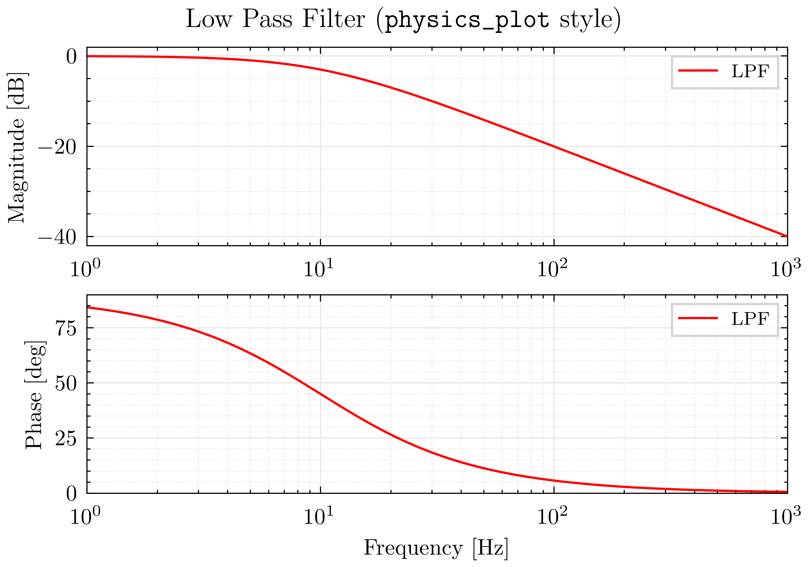
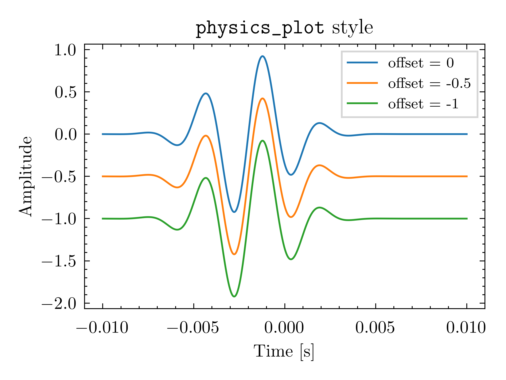
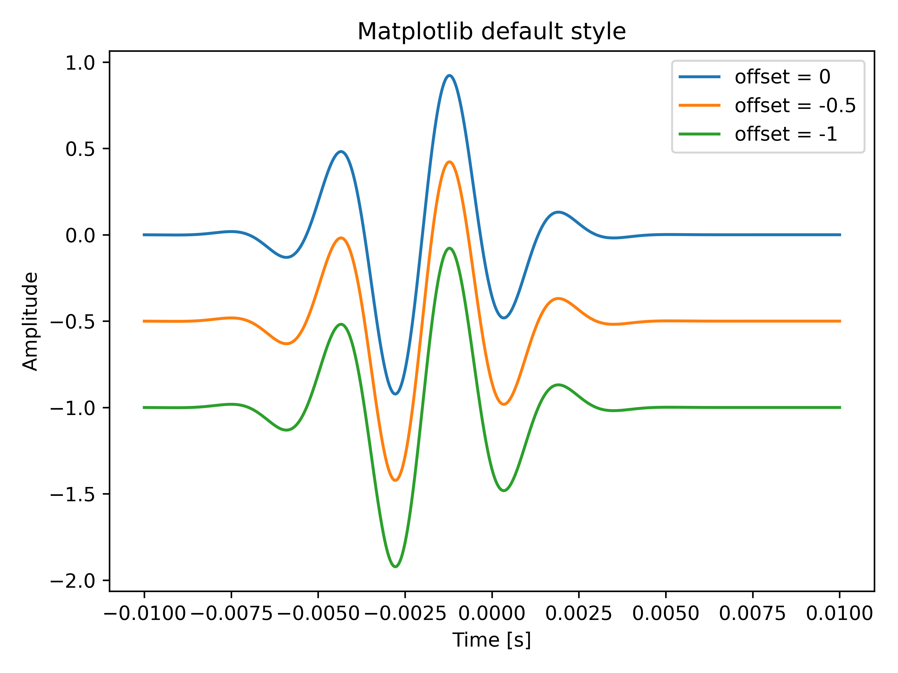

# Physics Plot

## What is `physics-plot`?

`physics-plot` is essentially a zero dependency python package shipping a Matplotlib style sheet [^mplstyle] — [`pp_base.mplstyle`](https://github.com/c0rychu/physics-plot/blob/main/src/physics_plot/pp_base.mplstyle) to create publication-quality plots with minimal effort. In addition, a few optional helper classes are provided.

An example Bode plot created with `physics-plot` looks like this:



## Style Comparison

Here's a side-by-side comparison of plotting with the `physics-plot` style and the Matplotlib default style:

| `physics-plot` style | Matplotlib default style |
|:--:|:--:|
|  |  |


## Quick Start

`physics-plot` can be installed via pip:
```bash
pip install physics-plot
```

There are basically two ways to use the `physics-plot` stylesheet. You can set it globally at the start of your script/notebook:
```python
import matplotlib.pyplot as plt

plt.style.use("physics_plot.pp_base")

# ======================= #
# Your plotting code here #
# ======================= #
```

Or you can apply it to individual figures using a context manager:
```python
import matplotlib.pyplot as plt

with plt.style.context("physics_plot.pp_base"):
    # ======================= #
    # Your plotting code here #
    # ======================= #
```

Yes! That's it! You are now ready to create beautiful, publication-quality plots with minimal effort using the `physics-plot` style. Enjoy plotting!


[^mplstyle]: Matplotlib style sheets (`.mplstyle` files) are configuration files that define the default appearance of plots created with Matplotlib. They allow users to customize various aspects of plot aesthetics, such as colors, fonts, line styles, and more, by specifying these settings in a structured format. See [Matplotlib Style Sheets Reference](https://matplotlib.org/stable/gallery/style_sheets/style_sheets_reference.html) for more details. Also, a default template can be found in the [Matplotlib documentation - Customizing Matplotlib with style sheets and rcParams](https://matplotlib.org/stable/users/explain/customizing.html#the-default-matplotlibrc-file) and its [source](https://github.com/matplotlib/matplotlib/blob/main/lib/matplotlib/mpl-data/matplotlibrc). Finally, several built-in `.mplstyle` files can be found [here](https://github.com/matplotlib/matplotlib/tree/main/lib/matplotlib/mpl-data/stylelib).