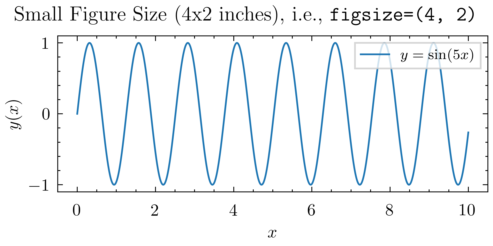

## Decreasing Figure Size to Increase Font Size

The first and the most important trick when plotting with Matplotlib is to set the figure size appropriately.
If you want to increase the font size and line width everywhere in the figure, the easiest way is to **decrease the figure size**!

!!! tip
    This is counter-intuitive at first, but it works because Matplotlib scales text elements (like axis labels, tick labels, legends, etc.) relative to the figure size.
    So a smaller figure size results in larger text elements, making them more readable.


```python
--8<-- "mpl/mpl-size.py"
```

 


## DPI

The native figure size unit in Matplotlib is inches as documented [here](https://matplotlib.org/stable/gallery/subplots_axes_and_figures/figure_size_units.html).
When we intentionally set a small figure size (e.g., 4x2 inches), we can increase the DPI (dots per inch) to get a larger (higher resolution / size in pixels) image without changing the relative sizes of text elements.

The DPI can be set when creating the figure using the `dpi` argument:

```python
import matplotlib.pyplot as plt
fig, ax = plt.subplots(figsize=(4, 2), dpi=600)
```
or specified when saving the figure using the `dpi` argument of `savefig`:

```python
fig.savefig("figure.png", dpi=600)
```
