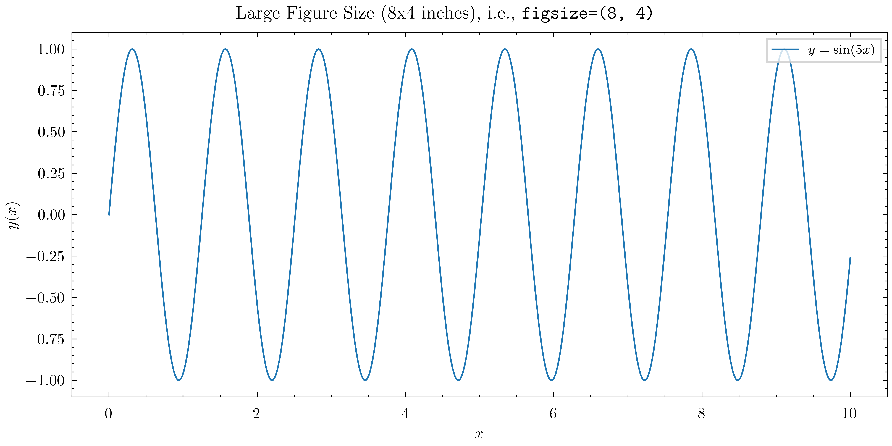

The first and the most important trick when plotting with Matplotlib is to set the figure size appropriately.
If you want to increase the font size and line width everywhere in the figure, the easiest way is to **decrease the figure size**!

!!! tip
    This is counter-intuitive at first, but it works because Matplotlib scales text elements (like axis labels, tick labels, legends, etc.) relative to the figure size.
    So a smaller figure size results in larger text elements, making them more readable.


```python
--8<-- "mpl/mpl-size.py"
```

 
